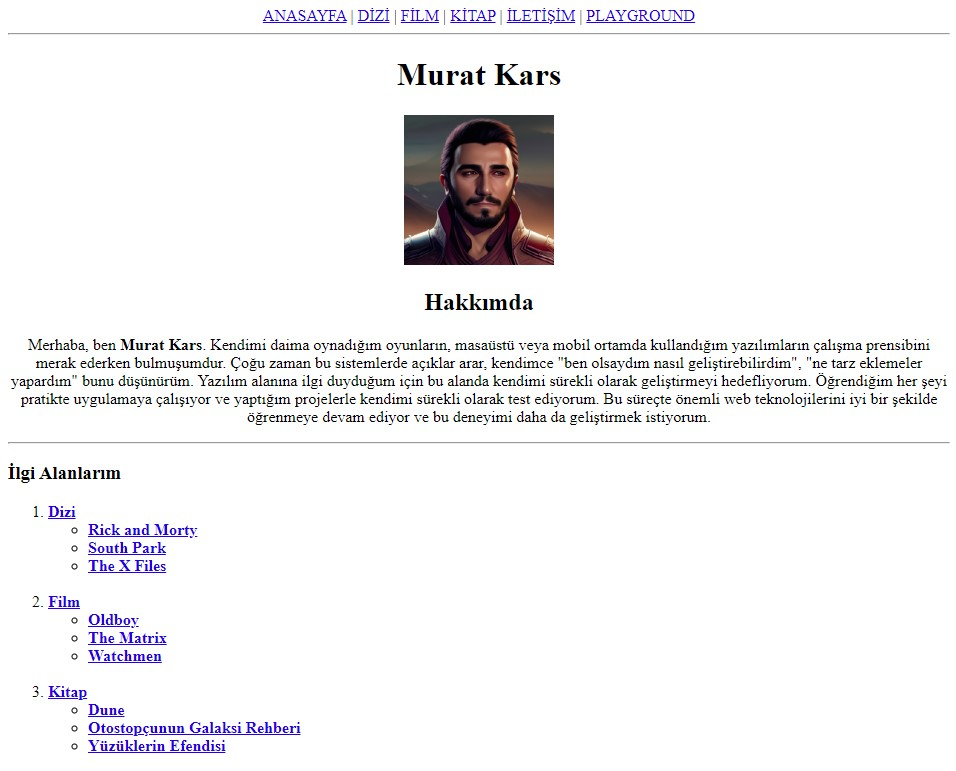

# Kodluyoruz - Patika HTML Ödev 2

[Kodluyoruz](https://www.kodluyoruz.org) Eğitimi kapsamında HTML Eğitimi Ödev 2 için oluşturduğum repo.

---

### Açıklama

Ana dizinde 6 adet sayfa ve dizi, film, kitap kategorileri altında her biri için 3 adet içerik sayfası olmak üzere toplam 12 adet sayfa oluşturulmuştur.

Dizi, film ve kitap kategorileri altında bulunan içerik sayfaları aynı tasarıma sahiptir.

Dizi sayfasında bulunan içerik sayfaları Rick and Morty, South Park ve The X-Files dizilerini içermektedir.

Film sayfasında bulunan içerik sayfaları The Matrix, Oldboy ve Watchmen filmlerini içermektedir.

_Dizi ve film sayfalarında dizilerin ve filmlerin isimleri, açıklamaları,resimleri, fragmanları ve içerik sayfalarına yönlendiren linkleri bulunmaktadır._

Kitap sayfasında bulunan içerik sayfaları Dune, Otostopçunun Galaksi Rehberi ve 1984 kitaplarını içermektedir.

_Kitap sayfasında kitapların isimleri, açıklamaları, resimleri ve içerik sayfalarına yönlendiren linkleri bulunmaktadır._

İletişim sayfası iletişim bilgilerini içermektedir.

Anasayfa sayfası tüm içerikleri içermektedir.

Playground sayfası ekran çözünürlüğü değiştiğinde farklı resimlerin yüklenmesini sağlamak için oluşturulmuştur.

**Sayfaların içeriği aşağıdaki gibidir:**

- ###### index.html: _Anasayfa_
- ###### dizi.html: _Dizi kategorisi_
  - ###### rickandmorty.html: _Rick and Morty detay sayfası_
  - ###### southpark.html: _South Park detay sayfası_
  - ###### thexfiles.html: _The X-Files detay sayfası_
- ###### film.html: _Film kategorisi_
  - ###### oldboy.html: _Oldboy detay sayfası_
  - ###### thematrix.html: _The Matrix detay sayfası_
  - ###### watchmen.html: _Watchmen detay sayfası_
- ###### kitap.html: _Kitap kategorisi_
  - ###### dune.html: _Dune detay sayfası_
  - ###### galaksirehberi.html: _Otostopçunun Galaksi Rehberi detay sayfası_
  - ###### yuzuklerinefendisi.html: _Yüzüklerin Efendisi detay sayfası_
- ###### iletisim.html: _İletişim sayfası_
- ###### playground.html: _Ekran çözünürlüğüne göre farklı resimler gösteren sayfa_

---

## Önizleme



## Kullanım

- ###### **_Repo'yu klonlayın._**

```bash
git clone https://github.com/KarsMurat/kodluyoruz-html-odev-2.git
```

- ###### **_"index.html" dosyasını doğrudan açın veya Visusal Studio Code ile aşağıdaki eklentiyi kurarak "index.html" dosyasını seçtikten sonra sağ alttaki "Go Live" butonuna basarak açın._**

Liver Server eklentisi: [https://marketplace.visualstudio.com/items?itemName=ritwickdey.LiveServer](https://marketplace.visualstudio.com/items?itemName=ritwickdey.LiveServer)

---

[www.patika.dev](https://www.patika.dev)
